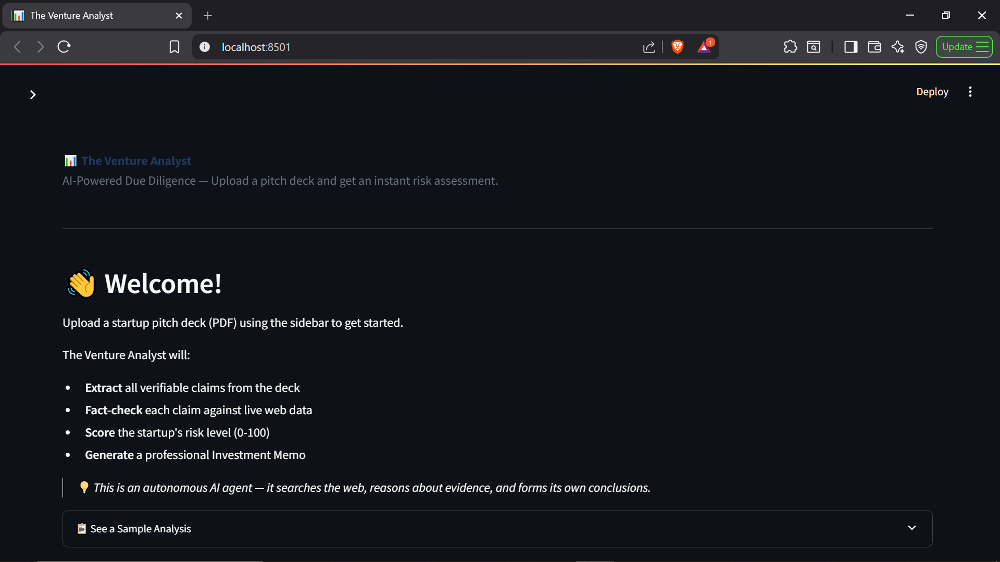
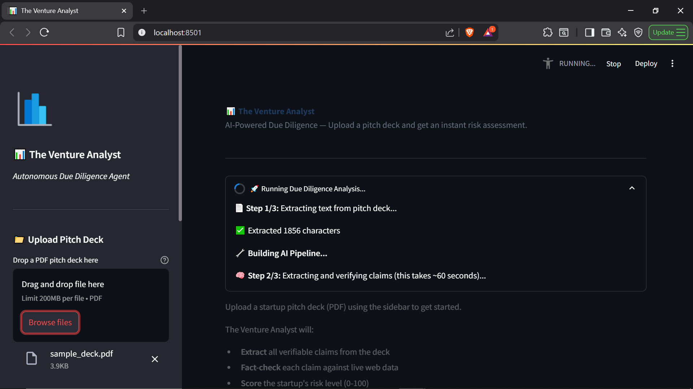
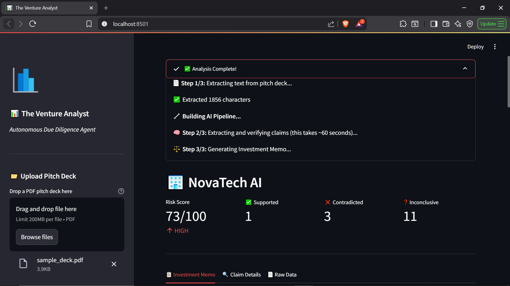
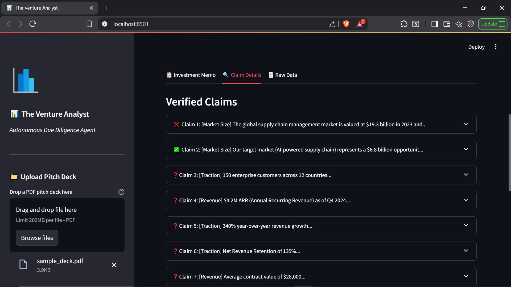
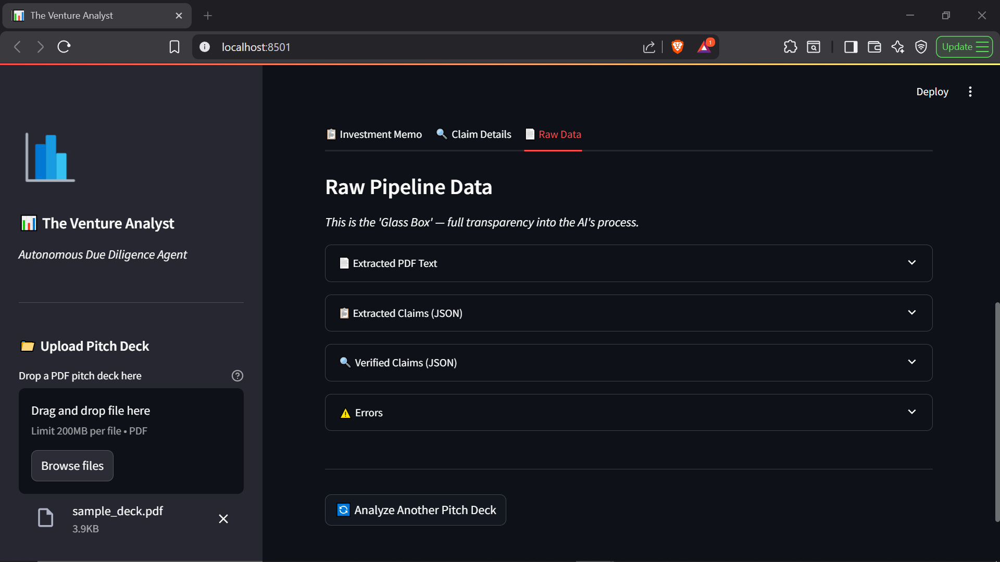
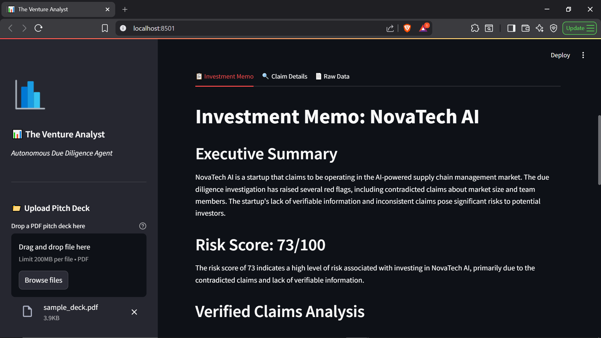
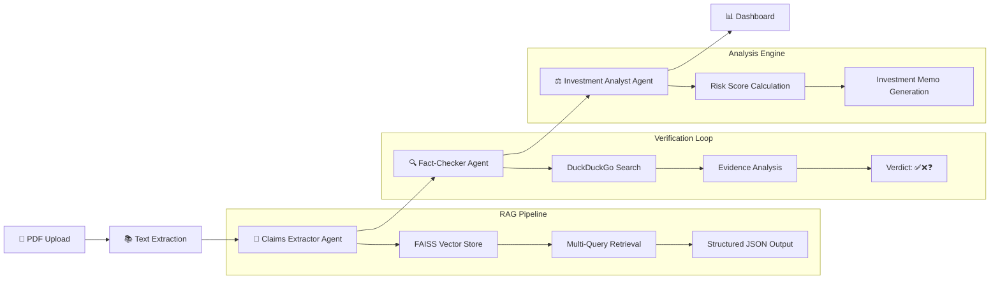

# 📊 The Venture Analyst Agent

> An Autonomous AI Due Diligence System that ingests startup pitch decks, extracts verifiable claims, fact-checks them against live web data, and generates professional Investment Memos with Risk Scores.


---

## 🎯 Problem

Venture Capital firms spend **40+ hours** per deal on due diligence, manually fact-checking claims in pitch decks. Most claims go unverified due to time constraints, leading to **information asymmetry** and poor investment decisions.

## 💡 Solution

**The Venture Analyst** is an autonomous AI agent that:
1. **Extracts** verifiable claims from pitch decks (PDF → Structured JSON)
2. **Fact-checks** each claim against live web data using DuckDuckGo Search
3. **Scores** the startup's risk level (0-100) based on verification results
4. **Generates** a professional Investment Memo with a clear recommendation

All in **under 2 minutes**, with full transparency into the AI's reasoning.

---

## 📸 Screenshots

### Landing Page
Upload a pitch deck to begin the autonomous analysis.


### Analysis in Progress
The AI extracts claims, searches the web, and generates a report — all autonomously.


### Risk Score Dashboard
At-a-glance metrics: Risk Score, Supported/Contradicted/Inconclusive claims.


### Claim-by-Claim Transparency ("Glass Box")
Every claim shows the verdict, reasoning, and raw search results. Full transparency.


### Raw Pipeline Data
This is the 'Glass Box' — full transparency into the AI's process.

📄 Extracted PDF Text

📋 Extracted Claims (JSON)

🔍 Verified Claims (JSON)

⚠️ Errors




### Investment Memo
AI Generated Investment Memo with Executive Summary, Verified Claims Analysis(Supported Claims, Contradicted Claims(RED FLAGS), Inconclusive Claims), Key Risk Factors, Investment Recommendation.


### Dashboard
Dashboard with Upload Pitch Deck, How It Works, Tech Stack.

---

## 🏗️ System Architecture



---

## 🛠️ Tech Stack

| Component | Technology | Purpose |
|---|---|---|
| **LLM** | Llama 3.3 70B (Groq) | Reasoning, extraction, analysis |
| **Orchestration** | LangGraph | State machine connecting all agents |
| **Vector Store** | FAISS + HuggingFace Embeddings | Semantic search over pitch deck |
| **Web Search** | DuckDuckGo Search | Real-time fact verification |
| **Structured Output** | Pydantic | Enforcing JSON schema from LLM |
| **Frontend** | Streamlit | Interactive "Glass Box" dashboard |
| **PDF Parsing** | pdfplumber | Text extraction from pitch decks |

---

## 🚀 Quick Start

### 1. Clone the Repository
```bash
git clone https://github.com/YOUR_USERNAME/Venture-Analyst-Agent.git
cd Venture-Analyst-Agent
```

### 2. Setup Environment
```bash
python -m venv venv
# Windows:
.\venv\Scripts\Activate
# Mac/Linux:
source venv/bin/activate

pip install -r requirements.txt
```

### 3. Configure API Key
```bash
# Create .env file
echo "GROQ_API_KEY=your_key_here" > .env
```
Get a free API key at [console.groq.com](https://console.groq.com)

### 4. Run the Dashboard
```bash
streamlit run app.py
```

---

## 📁 Project Structure

```
Venture-Analyst-Agent/
├── src/
│   ├── __init__.py        # Package initializer
│   ├── agents.py          # AI Agents (Extractor, Verifier, Analyst)
│   ├── graph.py           # LangGraph state machine
│   ├── state.py           # TypedDict state schema
│   └── utils.py           # PDF parsing & text processing
├── data/                  # Sample pitch decks
├── app.py                 # Streamlit dashboard
├── requirements.txt       # Dependencies
├── .env                   # API keys (not committed)
├── .gitignore
└── README.md
```

---

## 🧠 Key Design Decisions

### 1. Multi-Agent Architecture
Instead of a single monolithic prompt, the system uses **three specialized agents** connected via LangGraph. This follows the **Separation of Concerns** principle — each agent has one job and does it well.

### 2. Structured Output with Pydantic
The LLM doesn't return free text. Every output is validated against a **Pydantic schema**, ensuring downstream systems always receive valid JSON. This is critical for production reliability.

### 3. Strategic Multi-Query RAG
Instead of a single similarity search, the extractor uses **6 category-specific queries** (Market, Traction, Team, etc.) to ensure comprehensive coverage of the pitch deck.

### 4. "Glass Box" Transparency
The UI shows every intermediate step — extracted claims, search queries, raw search results, and reasoning. This builds **user trust** and enables human oversight of AI decisions.

---

## 📊 Sample Output

| Metric | Value |
|---|---|
| **Startup** | NovaTech AI |
| **Claims Extracted** | 16 |
| **Supported** | 2 ✅ |
| **Contradicted** | 2 ❌ |
| **Inconclusive** | 12 ❓ |
| **Risk Score** | 73/100 (HIGH) |
| **Recommendation** | Proceed with Caution |

---

## 🔮 Future Improvements

- [ ] Add support for image-based PDFs (OCR with Tesseract)
- [ ] Implement a comparison mode (analyze multiple decks side-by-side)
- [ ] Add Crunchbase API integration for richer company data
- [ ] Deploy to Streamlit Cloud for public access
- [ ] Add memory/caching to avoid re-processing uploaded decks

---

## 👤 Author

**Your Name**
- Portfolio: https://vaishnavak2001.github.io/
- LinkedIn: https://linkedin.com/in/vaishnav-ak
- GitHub: https://github.com/vaishnavak2001

---

## 📄 License

This project is licensed under the MIT License.